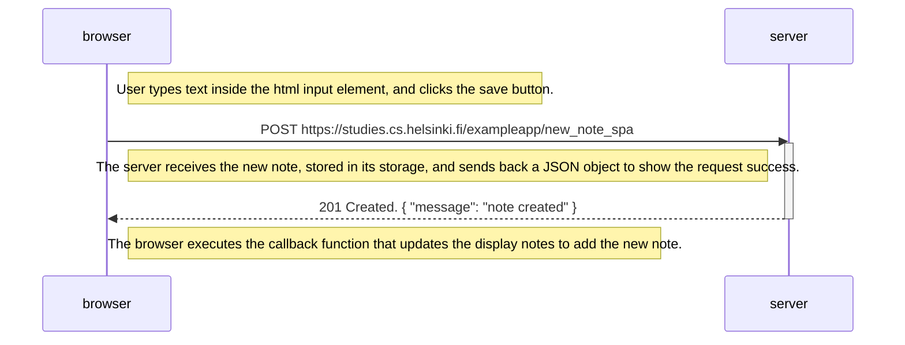

## Solution to exercise 0.6

The sequence diagram below describes the communication between the browser and the server when the spa version page creates a new note.

```mermaid
sequenceDiagram
    participant browser
    participant server

    Note right of browser: User types text inside the html input element, and clicks the save button.

    browser->>server: POST https://studies.cs.helsinki.fi/exampleapp/new_note_spa
    activate server

    Note left of server: The server receives the new note, stored in its storage, and sends back a JSON object to show the request success.

    server-->>browser: 201 Created. { "message": "note created" }
    deactivate server

    Note right of browser: The browser executes the callback function that updates the display notes to add the new note.
```
